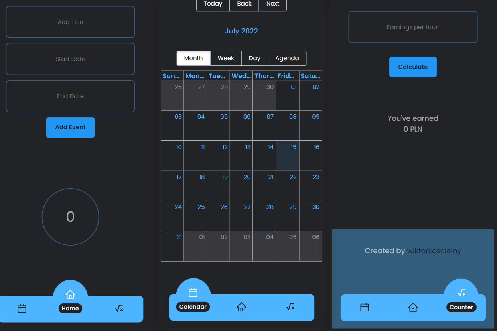

# React SPA CRUD Calendar App with Firebase 

## Table of contents
* [General info](#general-info)
* [Features](#features)
* [Setup](#setup)

## General info

Check how it works [here](https://wiktorkoscielny-react9.netlify.app)

This is app that I created for my own purposes. I was bored counting my working hours by my self, so I've decided to create app to set date and amount of hours that I worked on single project. 

To create this app I have used few function components. I have also used react calendar, countup and datepicker.
This app is connected with firebase. It Gets, Posts and Updates data from server. Due to api key danger this demo doesn't includes the config component, and code that is menaging data from server is commented. For demo purposes this app is only menaging functions state.
Real app has been published on another site with a secured api key on the backend server side.

This app was design for mobile devices, although it's well styled for desktop devices as well.

## Features

With this application you can set the number of hours you worked, the date you worked and calculate the amount of earnings based on the number of hours and the hourly rate ratio.

## Setup

1. `npm i npm i react-big-calendar`
2. `npm i react-datepicker`
3. `npm i react-icons`
4. `npm i react-firebase`
5. `npm i react-countup`
